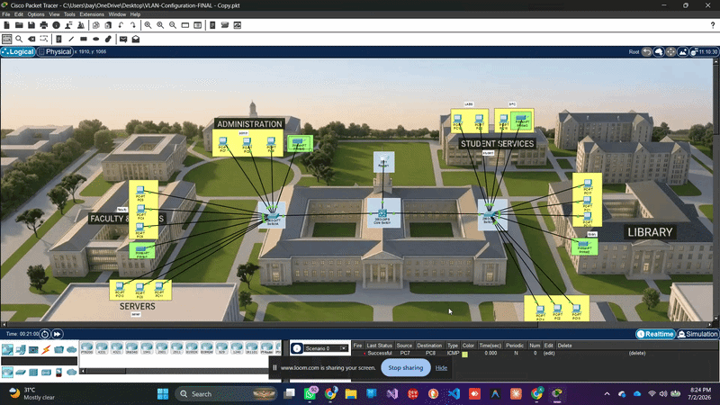
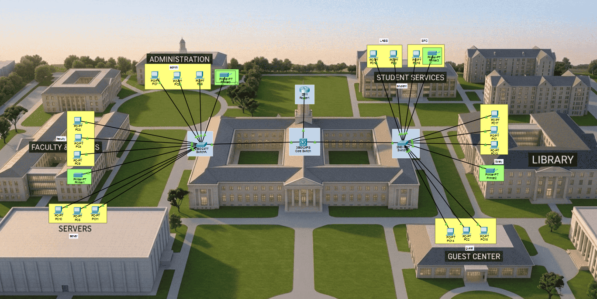
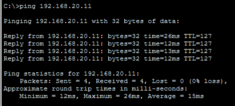
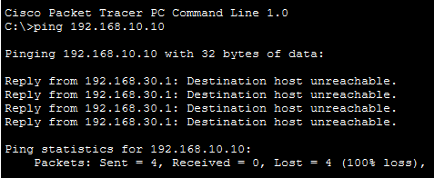
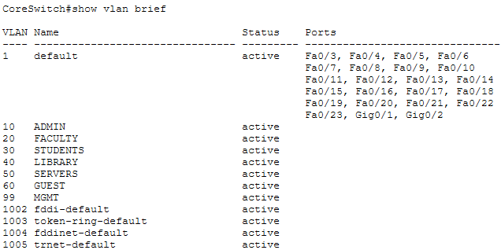
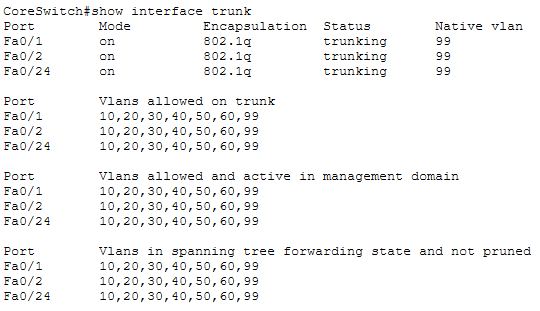
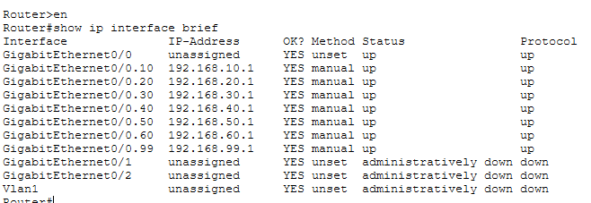
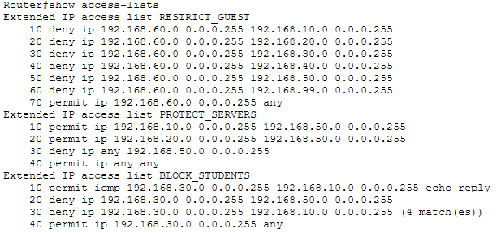

# 🌐 University Campus Network Design & Secure VLAN Implementation


A **Cisco Packet Tracer** project demonstrating the design, implementation, and security of a **University Campus Network** using **Virtual LANs (VLANs)**, **802.1Q trunking**, **Router-on-a-Stick Inter-VLAN Routing**, and **Access Control Lists (ACLs)**.

---

# 🎥 Demo

<p align="center">

</p>

---

# 📸 Network Topology

<p align="center">

</p>

---

# ✨ Features

- University Campus Network Design
- 7 Department-based VLANs
- Router-on-a-Stick Inter-VLAN Routing
- IEEE 802.1Q Trunking
- Extended ACL Security Policies
- Department-wise Network Segmentation
- Management VLAN
- Cisco IOS CLI Configuration
- Core & Access Switch Architecture
- Secure Traffic Isolation
- End-to-End Connectivity Testing

---

# 🧠 Networking Concepts Demonstrated

- VLANs
- Router-on-a-Stick
- Inter-VLAN Routing
- Extended ACLs
- 802.1Q Trunking
- Access Ports
- Trunk Ports
- Broadcast Domains
- Network Segmentation
- Cisco IOS CLI
- Layer-2 Switching
- Basic Network Security

---
---

# 🏷️ VLAN Assignment

| VLAN ID | Department | Subnet |
|----------|------------|----------------|
| 10 | Administration | 192.168.10.0/24 |
| 20 | Faculty | 192.168.20.0/24 |
| 30 | Students | 192.168.30.0/24 |
| 40 | Library | 192.168.40.0/24 |
| 50 | Servers | 192.168.50.0/24 |
| 60 | Guest | 192.168.60.0/24 |
| 99 | Management | 192.168.99.0/24 |

---

# 📡 Connectivity Tests

| Successful Inter-VLAN Routing | ACL Security Enforcement |
|-------------------------------|--------------------------|
|  |  |

---

# 🔒 ACL Demonstration

The project secures the campus network using **Extended Access Control Lists (ACLs)**.

Implemented policies include:

- Students cannot access Admin systems.
- Students cannot access Servers.
- Guests cannot access internal VLANs.
- Faculty can access Servers.
- Administrators have unrestricted access.
- Management VLAN remains protected.

---

# 📷 Configuration Verification

| VLAN Configuration | Trunk Configuration |
|-------------------|---------------------|
|  |  |

| Router Interfaces | ACL Verification |
|------------------|------------------|
|  |  |

---
---

# 📂 Project Structure

```text
.
├── screenshots/
│   ├── demo.gif
│   ├── vlan-brief.png
│   ├── trunk.png
│   ├── interfaces.png
│   ├── acl.png
│   ├── ping-success.png
│   ├── ping-blocked.png
│   ├── network.png
│   └── maju-logo.png
│
├── University-Campus-Network.pkt
└── README.md
```

---

# 🚀 Getting Started

### Requirements

- Cisco Packet Tracer 8.x or later

### Open the Project

1. Launch Cisco Packet Tracer.
2. Open **University-Campus-Network.pkt**.
3. Explore the network topology.
4. Verify VLAN assignments.
5. Test inter-VLAN routing.
6. Validate ACL rules using ping tests.

---

# ✅ Verification Commands

```bash
show vlan brief

show interfaces trunk

show ip interface brief

show access-lists

show running-config
```

---

# 🛡 Security Policies

| Source | Destination | Result |
|---------|-------------|--------|
| Students | Servers | ❌ Denied |
| Students | Administration | ❌ Denied |
| Guests | Internal VLANs | ❌ Denied |
| Faculty | Servers | ✅ Allowed |
| Administration | All VLANs | ✅ Allowed |

---

# 🛠 Technologies

- Cisco Packet Tracer
- Cisco IOS
- VLANs
- IEEE 802.1Q
- Router-on-a-Stick
- Extended ACLs
- Layer-2 Switching
- Campus Network Design

---

# 👥 Team

| Roll No. | Name |
|----------|------|
| SP24-BSCS-0099 | Areeba Kalwar |
| SP24-BSCS-0011 | Laiba Zareen |
| SP24-BSCS-0110 | Laiba Younus |
| SP24-BSCS-0106 | Tehseen Bano |
| SP24-BSCS-0040 | Syeda Hafsa |

---

---
## 🎓 Course

<p align="center">
  
</p>

<p align="center">
<strong>Mohammad Ali Jinnah University</strong><br>
Data Communication & Networks (DCN)
</p>

---

# ⭐ Acknowledgements

Developed as part of the **Data Communication & Networks** course to demonstrate VLAN implementation, secure network segmentation, Router-on-a-Stick inter-VLAN routing, IEEE 802.1Q trunking, and Access Control Lists (ACLs) using Cisco Packet Tracer.
